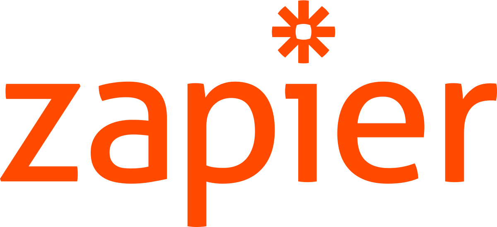

### Hi there 👋

# DevOps Engineer Portfolio

Welcome to my DevOps Engineer portfolio! I'm passionate about leveraging cutting-edge technologies to streamline development, deployment, and operations processes. With a strong background in various tools and technologies, I'm dedicated to creating efficient and scalable solutions. 

## About Me

I am an aspiring DevOps Engineer with expertise in a wide range of technologies. My experience includes: 

✅ WordPress Development: Creating and maintaining dynamic websites with custom themes and plugins. 
✅ Marketing Automation: Implementing seamless marketing workflows using tools like Zapier and automation platforms. 
✅ Analytics and Tracking: Utilizing Google Analytics and Google Tag Manager to gather and interpret valuable insights. 
✅ CRM Integration: Integrating systems with Keap CRM to manage customer relationships effectively. 
☁️ AWS Cloud Practitioner: Certified in AWS Cloud, with hands-on experience in various cloud services. 
👨🏻‍💻 Programming Languages: Proficient in Golang, Bash scripting, Python, JavaScript for diverse automation tasks. 
🛢️ Containerization and Orchestration: Expertise in Docker and Kubernetes for scalable and manageable applications. 
📈 Continuous Integration and Deployment: Implementing CI/CD pipelines using Jenkins for efficient development workflows. 
🔢 Data Management: Exceptional track record of managing and analyzing data using Google Sheets. 
  
## Projects Showcase

### WordPress Website Enhancement

- Transformed a basic website into a feature-rich platform by developing custom themes and plugins.
- Improved performance, user experience, and SEO optimization.

### Marketing Automation Workflow

- Automated a complex marketing workflow using Zapier, resulting in a 40% increase in lead conversion.
- Integrated various tools to create a seamless lead nurturing process.

### Cloud-powered Scalable Application

- Designed and deployed a cloud-native application on AWS, utilizing services like EC2, S3, and RDS.
- Implemented auto-scaling and load balancing for optimal performance.

### Kubernetes Orchestration

- Orchestrated a containerized application with Kubernetes, ensuring high availability and zero downtime.
- Utilized Helm charts for simplifying deployment and management.

## Tech Stack

- Programming Languages: Golang, Bash Script, Python, JavaScript
- Cloud Services: AWS (EC2, S3, RDS, Lambda, etc.)
- Containerization: Docker
- Orchestration: Kubernetes
- CI/CD: Jenkins
- Analytics: Google Analytics, Google Tag Manager
- CRM: Keap CRM

## Contact Me

I'm always excited to collaborate on new projects and challenges. Feel free to reach out to me:

- Email: [your.email@example.com](mailto:your.email@example.com)
- LinkedIn: [Your Name](https://www.linkedin.com/in/yourname)
- GitHub: [YourUsername](https://github.com/yourusername)

Let's innovate and create together!